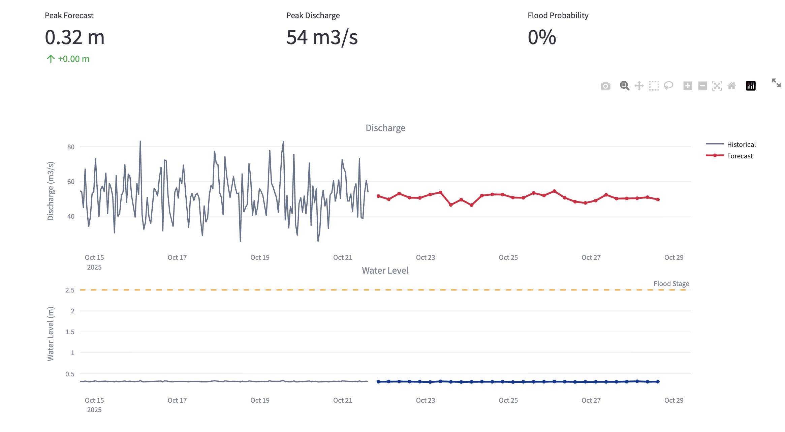

# 🇳🇵 Nepal Flood Intelligence Platform

Real-time flood forecasting and risk analysis for Nepal's major river basins using ERA5 climate data and deep learning.


## 🌟 Features

- **Real-time Monitoring**: Track water levels and discharge for 5 major rivers
- **ERA5 Climate Data**: Powered by Copernicus Climate Reanalysis
- **7-Day Forecasts**: LSTM-based flood prediction
- **Historical Analysis**: 5-year trend analysis and seasonal patterns
- **Flash Flood Detection**: Identify extreme events and timing patterns
- **Smart Caching**: Instant load times with 24-hour data refresh

## 🏞️ River Stations

| River | Station | Drainage Area | District |
|-------|---------|---------------|----------|
| Bagmati | Khokana | 678 km² | Lalitpur |
| Koshi | Chatara | 54,100 km² | Sunsari |
| Narayani | Narayanghat | 31,100 km² | Chitwan |
| Karnali | Chisapani | 42,890 km² | Bardiya |
| Kankai | Mainachuli | 1,148 km² | Jhapa |

## 🚀 Quick Start

### Prerequisites
- Python 3.8 or higher
- pip package manager

### Installation

1. **Clone the repository**
   ```bash
   git clone https://github.com/Sujan-Bhattarai12/nepal-flood-intelligence.git
   cd nepal-flood-intelligence
   ```

2. **Install dependencies**
   ```bash
   pip install -r requirements.txt
   ```

3. **Configure ERA5 API (Optional)**

   For real climate data, register at [Copernicus CDS](https://cds.climate.copernicus.eu) and create `~/.cdsapirc`:
   ```
   url: https://cds.climate.copernicus.eu/api/v2
   key: YOUR_UID:YOUR_API_KEY
   ```

   *Note: The app works with synthetic data by default for testing purposes.*

4. **Run the application**
   ```bash
   streamlit run app.py
   ```

5. **Open in browser**

   Navigate to `http://localhost:8501`

## 📊 Dashboard Preview

### Overview Dashboard


### Forecast Analysis


### Historical Analysis


## 📁 Project Structure

```
nepal-flood-intelligence/
├── app.py                          # Main Streamlit application entry point
├── requirements.txt                # Python dependencies
├── README.md                       # Project documentation
├── archive/
│   └── app_original.py            # Legacy monolithic version
├── assets/
│   └── images/                    # Application assets
│       └── river-background.jpg
├── cache/                         # Data and model cache (auto-generated)
├── docs/
│   └── images/                    # Documentation screenshots
├── notebooks/                     # Development notebooks
│   ├── 01-era5-data-collection.ipynb
│   ├── 02-flood-event-analysis.ipynb
│   ├── 03-lstm-model-training.ipynb
│   └── 04-visualization-development.ipynb
└── src/                           # Core package
    ├── __init__.py               # Package exports
    ├── config.py                 # Configuration and constants
    ├── data_loader.py            # ERA5 data loading and caching
    ├── analytics.py              # Flood detection algorithms
    ├── models.py                 # PyTorch LSTM architecture
    └── dashboard.py              # Streamlit UI components
```

## 🏗️ Architecture

### Core Components

- **`src/config.py`**: System configuration, river stations, and LSTM hyperparameters
- **`src/data_loader.py`**: ERA5 climate data fetching and cache management
- **`src/analytics.py`**: Flood event detection, severity classification, and risk analysis
- **`src/models.py`**: Deep learning models for flood forecasting (LSTM)
- **`src/dashboard.py`**: Interactive Streamlit dashboard components

### Data Flow

1. **Data Collection**: ERA5 climate reanalysis data via Copernicus CDS API
2. **Processing**: Rating curve transformations for discharge-to-water-level conversion
3. **Analysis**: Flood event detection and severity classification
4. **Forecasting**: 7-day LSTM predictions with confidence intervals
5. **Visualization**: Interactive Plotly charts in Streamlit dashboard

## 🔧 Configuration

### River Station Configuration

Edit `src/config.py` to modify:
- River monitoring stations
- Drainage basin areas
- Geographic coordinates
- Flood thresholds
- LSTM model parameters

### Cache Settings

- **Location**: `cache/` directory (auto-generated)
- **Data TTL**: 24 hours
- **Model TTL**: 7 days

## 🧪 Development

### Running Notebooks

Explore individual components:

```bash
jupyter notebook notebooks/01-era5-data-collection.ipynb
```

### Notebooks Overview

- **01-era5-data-collection**: Climate data fetching and preprocessing
- **02-flood-event-analysis**: Statistical analysis and event detection
- **03-lstm-model-training**: Deep learning model development
- **04-visualization-development**: Chart prototyping and design

## 📦 Dependencies

- **Streamlit**: Interactive web dashboard
- **PyTorch**: Deep learning framework for LSTM models
- **Plotly**: Interactive data visualizations
- **Pandas/NumPy**: Data manipulation and analysis
- **cdsapi**: Copernicus Climate Data Store API client
- **xarray/netCDF4**: Climate data file handling

See `requirements.txt` for complete list with version constraints.

## 🤝 Contributing

Contributions are welcome! Please feel free to submit issues or pull requests.

## 📄 License

This project is open source and available under the MIT License.

## 🙏 Acknowledgments

- **ERA5 Data**: [Copernicus Climate Change Service](https://cds.climate.copernicus.eu)
- **River Data**: Nepal Department of Hydrology and Meteorology
- **Framework**: Built with Streamlit and PyTorch

## 📧 Contact

For questions or feedback, please open an issue on GitHub.

---

**Built with ❤️ for Nepal's flood resilience**
