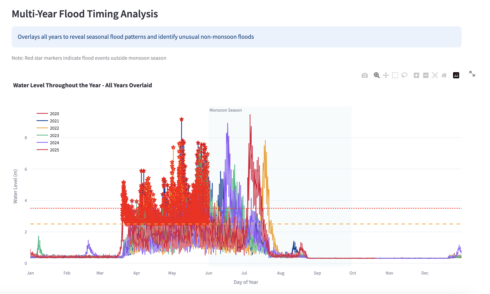
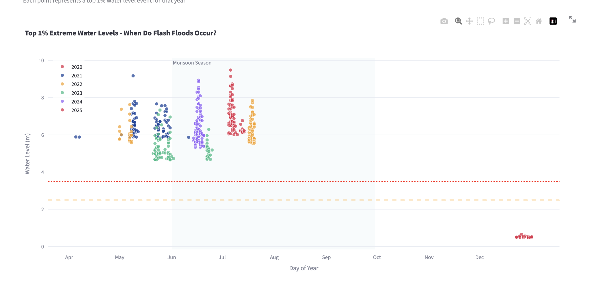
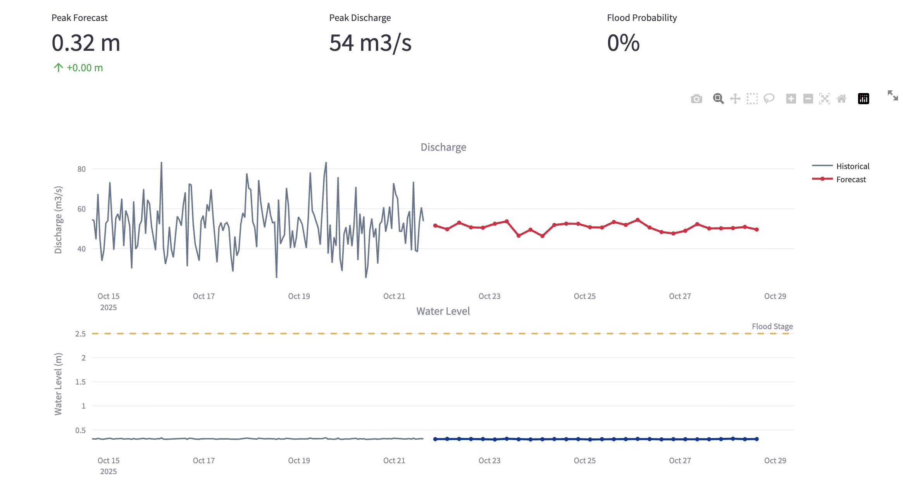

# Nepal Flood Intelligence Platform

Nepal loses lives and livelihoods to floods every monsoon season. The five major river basins — Bagmati, Koshi, Narayani, Karnali, and Kankai — together drain over 130,000 square kilometers of Himalayan terrain and regularly flood downstream communities with little warning.

This platform is a real-time flood forecasting and risk analysis system built to address that gap. It monitors water levels and discharge across five river gauging stations, generates seven-day flood forecasts using a deep learning model trained on ERA5 climate reanalysis data from the Copernicus Climate Change Service, and identifies extreme events and seasonal flood patterns from five years of historical records.

## Features

- Real-time monitoring of water levels and discharge for 5 major river basins
- Seven-day flood forecasts powered by an LSTM deep learning model trained on ERA5 climate reanalysis data
- Flash flood detection with severity classification and risk analysis
- Five-year historical trend analysis and seasonal pattern identification
- Local data caching for fast load times and offline resilience during flood events

## River Monitoring Stations

| River | Station | Drainage Area | District |
|-------|---------|---------------|----------|
| Bagmati | Khokana | 678 km² | Lalitpur |
| Koshi | Chatara | 54,100 km² | Sunsari |
| Narayani | Narayanghat | 32,000 km² | Chitwan |
| Karnali | Chisapani | 43,900 km² | Bardiya |
| Kankai | Mainachuli | 1,148 km² | Jhapa |

## Dashboard Preview

### Overview Dashboard


### Forecast Analysis


### Historical Analysis


## How It Works

The system pulls precipitation and atmospheric data from the ERA5 climate reanalysis archive via the Copernicus CDS API. That data feeds a Long Short-Term Memory (LSTM) neural network — a class of deep learning model well suited to time-series prediction — which produces discharge forecasts with confidence intervals for each station. A flood detection algorithm then classifies events by severity and flags high-risk periods for emergency planners.

The architecture is modular: data loading, flood analytics, model inference, and the dashboard interface are each maintained as separate components, making it straightforward to extend the system to new river basins or integrate additional data sources.

## Quick Start

### Prerequisites

- Python 3.8 or higher
- pip package manager

### Installation

1. Clone the repository

```bash
git clone https://github.com/Sujan-Bhattarai12/nepal-flood-intelligence.git
cd nepal-flood-intelligence
```

2. Install dependencies

```bash
pip install -r requirements.txt
```

3. Configure ERA5 API (Optional)

For live climate data, register at [Copernicus CDS](https://cds.climate.copernicus.eu) and create `~/.cdsapirc`:

```
url: https://cds.climate.copernicus.eu/api/v2
key: YOUR_UID:YOUR_API_KEY
```

The system runs on synthetic data by default for testing and demonstration purposes.

4. Run the application

```bash
streamlit run app.py
```

5. Open in browser

Navigate to `http://localhost:8501`

## Project Structure

```
nepal-flood-intelligence/
├── app.py                          # Main Streamlit application entry point
├── requirements.txt                # Python dependencies
├── README.md                       # Project documentation
├── archive/
│   └── app_original.py            # Legacy monolithic version
├── assets/
│   └── images/                    # Application assets
│       └── river-background.jpg
├── cache/                         # Data and model cache (auto-generated)
├── docs/
│   └── images/                    # Documentation screenshots
├── notebooks/                     # Development notebooks
│   ├── 01-era5-data-collection.ipynb
│   ├── 02-flood-event-analysis.ipynb
│   ├── 03-lstm-model-training.ipynb
│   └── 04-visualization-development.ipynb
└── src/                           # Core package
    ├── __init__.py               # Package exports
    ├── config.py                 # Configuration and constants
    ├── data_loader.py            # ERA5 data loading and caching
    ├── analytics.py              # Flood detection algorithms
    ├── models.py                 # PyTorch LSTM architecture
    └── dashboard.py              # Streamlit UI components
```

## Architecture

The platform is built around four core components:

- **config.py** — System configuration, river station definitions, and LSTM hyperparameters
- **data_loader.py** — ERA5 climate data fetching and local cache management
- **analytics.py** — Flood event detection, severity classification, and risk analysis
- **models.py** — Deep learning models for flood forecasting (LSTM)
- **dashboard.py** — Interactive Streamlit dashboard components

Data flows through the system in five stages: ERA5 reanalysis data is fetched via the Copernicus CDS API, transformed using rating curve methods to convert discharge into water levels, analyzed for flood events and severity, passed through the LSTM for seven-day forecasting, and rendered as interactive Plotly charts in the Streamlit dashboard.

## Configuration

River station parameters, drainage basin areas, geographic coordinates, flood thresholds, and LSTM model hyperparameters are all defined in `src/config.py`. The data cache is stored in the `cache/` directory and refreshes automatically every 24 hours for observational data and every 7 days for model weights.

## Development

Individual components can be explored through the development notebooks:

```bash
jupyter notebook notebooks/01-era5-data-collection.ipynb
```

- **01-era5-data-collection** — Climate data fetching and preprocessing
- **02-flood-event-analysis** — Statistical analysis and event detection
- **03-lstm-model-training** — Deep learning model development
- **04-visualization-development** — Chart prototyping and design

## Dependencies

- **Streamlit** — Interactive web dashboard
- **PyTorch** — Deep learning framework for LSTM models
- **Plotly** — Interactive data visualizations
- **Pandas / NumPy** — Data manipulation and analysis
- **cdsapi** — Copernicus Climate Data Store API client
- **xarray / netCDF4** — Climate data file handling

See `requirements.txt` for the complete list with version constraints.

## Intended Use

The platform is designed for use by emergency management agencies, hydrologists, and local authorities who need actionable forecasts rather than raw model output. All code is open source under the MIT License.

## Contributing

Contributions are welcome. Please feel free to submit issues or pull requests.

## Acknowledgments

- **ERA5 Data** — [Copernicus Climate Change Service](https://cds.climate.copernicus.eu)
- **River Data** — Nepal Department of Hydrology and Meteorology
- **Framework** — Built with Streamlit and PyTorch

## Contact

For questions or feedback, please open an issue on GitHub.
